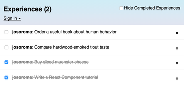
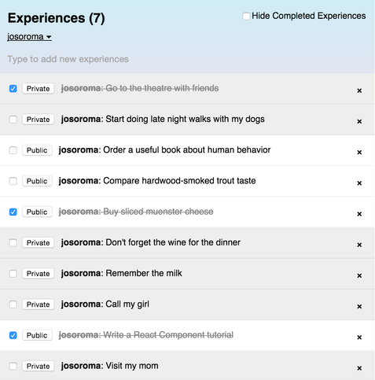

Meteor React Experiment
=======================



## Create a Meteor App

```
meteor create experiences
```

```
cd experiences
```

## Use React as a View Library

```
meteor add react
```

Includes everything we need to get started using React in Meteor:

 - The React library itself.

 - Automatic compilation of .jsx files.

 - A ReactMeteorData mixin for loading data.

```
rm experiences.js

touch experiences.jsx App.jsx Experience.jsx
```

## Storing Items in a Collection

In the web browser, we will see the UI of our app immediately update to show the new item, it just happens automatically for us.

```
meteor mongo

db.experiences.insert({ title: "My First Experience", createdAt: new Date() });
db.experiences.insert({ title: "My Second Experience", createdAt: new Date() });
db.experiences.insert({ title: "My Third Experience", createdAt: new Date() });
```

## Deploy

```
meteor deploy experiences.meteor.com
```

## Meteor work across different platforms

```
meteor install-sdk ios && meteor add-platform ios

meteor run ios
```

## Accounts System and Login User Interface

 - http://docs.meteor.com/#/full/accounts_api

```
meteor add accounts-ui accounts-password
```

We can add the accounts-facebook package to enable Facebook login in our app - the Facebook button will automatically appear in the dropdown.

```
meteor add accounts-facebook

meteor add accounts-twitter
```

### UI - Pre-built Forms

Pre-built forms for common methods like login, signup, password change, and password reset.

 - http://docs.meteor.com/#/full/accountsui

## Remove the Insecure Package

It allows us to edit the database from the client. It's useful when prototyping, but now we are taking off the training wheels.

```
meteor remove insecure

meteor list
```

### Methods and Optimistic UI

When we call a method on the client using `Meteor.call`, two things happen in parallel:

 - The client sends a request to the server to run the method in a secure environment, just like an AJAX request would work

 - A simulation of the method runs directly on the client to attempt to predict the outcome of the server call using the available information

What this means is that a newly created `experience` actually appears on the screen before the result comes back from the server.

With `Meteor methods` and `Optimistic UI`, we get the best of both worlds — the security of server code and no round-trip delay.

## Filtering data with publish and subscribe



We need a way of controlling which data Meteor sends to the client-side database. Just like with insecure in the last step, all new Meteor apps start with the `autopublish` package, which automatically synchronizes all of the database contents to the client.

When the app refreshes, the experiences list will be empty. Without the `autopublish` package, we will have to specify explicitly what the server sends to the client.

```
meteor remove autopublish
```

## Extra Security Checks

The private experience feature add checks within deleteExperience and setChecked methods to make sure only the experience owner can delete or check off a private experience.

## Structuring our Meteor React App

```
mkdir -p client/compatibility client/helpers client/wrappers server public/img public/js public/css private lib/collections tests
```

 - `client`, similar to wrapping your code in `if (Meteor.isClient) { ... }`.

 - `server`, similar to wrapping your code in `if (Meteor.isServer) { ... }`.

 - `public`, when referencing these assets, do not include public/ in the URL, for example: ``. This is the best place for favicon.ico, robots.txt, and similar files.

 - `private` are only accessible from `server` code and can be loaded via the Assets API. This can be used for private data files.

 - `client/compatibility` is for compatibility JavaScript libraries that rely on variables declared with var at the top level being exported as globals. Files in this directory are executed without being wrapped in a new variable scope. These files are executed before other client-side JavaScript files.

 - `tests` folder is not loaded anywhere. Used for any local test code.

 - `node_modules` for compatibility with `node.js` tools used alongside Meteor, any directory named node_modules is not loaded anywhere. node.js packages installed into node_modules directories will not be available to our Meteor code. Use `Npm.depends` in your package package.js file for that.

### Initial Structure

```
tree -d

├── client
│   ├── compatibility
│   ├── helpers
│   └── wrappers
├── lib
│   └── collections
├── private
├── public
│   ├── css
│   ├── img
│   └── js
├── server
└── tests
```

### Meteor React Components Structure

```
tree

├── client                                                       Meteor.isClient
│   ├── compatibility
│   ├── config
│   │   └── accounts.ui.js
│   ├── helpers
│   ├── react                                                   React Components
│   │   ├── Main.jsx
│   │   ├── components
│   │   │   ├── App.jsx
│   │   │   └── Experience.jsx
│   │   └── wrappers
│   │       └── AccountsUIWrapper.jsx
│   ├── startup.js
│   └── subscriptions.js                                           Subscriptions
├── experiences.css
├── experiences.html
├── lib                                       Meteor.isClient || Meteor.isServer
│   └── collections
│       └── experiences.js
├── private
├── public
│   ├── css
│   ├── img
│   │   ├── experiences-in.png
│   │   └── experiences-out.png
│   └── js
├── readme.md
├── server                                                       Meteor.isServer
│   └── publications.js                                             Publications
│   └── startup.js
└── tests
```

```
tree -d

├── client
│   ├── compatibility
│   ├── config
│   ├── helpers
│   └── react
│       ├── components
│       └── wrappers
├── lib
│   └── collections
├── private
├── public
│   ├── css
│   ├── img
│   └── js
├── server
└── tests
```

## "minimongo"

The Mongo.Collection class is used to declare `Mongo collections` and to manipulate them. Thanks to `minimongo`, Meteor's client-side Mongo emulator, `Mongo.Collection` can be used from both Client and Server code.

```
meteor mongo

db.experiences.find({}).pretty();

db.experiences.insert({
  "title" : "Remember the milk 1",
  "createdAt" : new Date(),
  "owner" : "WQ73QruW6K4akRxqS",
  "username" : "josoroma",
  "private" : true,
  "checked" : false
});

db.experiences.insert({
  "title" : "Remember the milk 2",
  "createdAt" : new Date(),
  "owner" : "WQ73QruW6K4akRxqS",
  "username" : "josoroma",
  "private" : true,
  "checked" : false
});

db.experiences.insert({
  "title" : "Remember the milk 3",
  "createdAt" : new Date(),
  "owner" : "WQ73QruW6K4akRxqS",
  "username" : "josoroma",
  "private" : true,
  "checked" : false
});

db.experiences.find({}).limit(3).sort({_id:-1}).pretty();
```

### Fixing _id type

```
db.experiences.find().forEach(function(doc) {
  var doc = db.experiences.findOne();
  var title = doc.title;
  var id = doc._id;
  doc._id = ObjectId();
  db.experiences.insert(doc);
  db.experiences.remove({_id: id});
})

db.experiences.find({}).limit(3).sort({_id:-1}).pretty();
```

#### idGeneration type

```
Experiences = new Meteor.Collection("experiences", {idGeneration : 'MONGO'});

Experiences = new Meteor.Collection("experiences", {idGeneration : ’STRING’});
```

#### Reactivity

 - http://docs.meteor.com/#/full/reactivity

Meteor embraces the concept of reactive programming. This means that we can write our code in a simple imperative style, and the result will be automatically recalculated whenever data changes that our code depends on.

### (Server === Mongo && Client === minimongo)

## Just Use The Browser Console

We use `fetch()` on the cursor to transform the `reactive datasource` into an `array`.

```
Experiences.find().fetch();

Experiences.insert({
  "title" : "Please, remember the milk",
  "createdAt" : new Date(),
  "owner" : "WQ73QruW6K4akRxqS",
  "username" : "josoroma",
  "private" : true,
  "checked" : false
});
```

Each document set or collection is defined by a `publish` function on the server. The `publish` function runs each time a new client subscribes to a document set. The data in a document set can come from anywhere, but the common case is to `publish` a database query.

Once `subscribed`, the client uses its Mongo Cache as a fast local database, dramatically simplifying client code. Reads never require a costly `round trip` to the server. And they're limited to the contents of the cache: a query for every document in a collection on a client will only return documents the server is publishing to that client.

DDP is like "Rest for Websockets"
=================================

DDP (Distributed Data Protocol) is the stateful websocket protocol that Meteor uses to communicate between the client and the server. Meteor's latency-compensated distributed data framework:

 - https://github.com/meteor/meteor/blob/devel/packages/ddp/DDP.md

 - https://www.meteor.com/ddp

 - https://meteorhacks.com/introduction-to-ddp

 - http://meteorpedia.com/read/DDP_Clients

 - https://www.meteor.com/full-stack-db-drivers

 - http://tagrudev.com/blog/what-is-ddp-and-why-should-i-care

 - https://vimeo.com/52656246

"DDP has a nice feature: it notifies the caller after all the write operations in the method have been reflected to all the other connected clients."

"This is the core part of the DDP protocol. A client can use it to subscribe into a real-time data source and get notifications. The DDP protocol has three types of notification: `added`, `changed` and `removed`. Since the DDP protocol was inspired by MongoDB, each data notification (a JSON object) is assigned to a collection, which is the place where the data belongs."

## Discover Meteor DDP in Realtime

 - https://meteorhacks.com/discover-meteor-ddp-in-realtime

```
npm install -g ddp-analyzer
```

## Install Flow Router and React Layout

 - https://github.com/kadirahq/flow-router

Flow Router is focused only on routing for client-side apps and does not handle rendering itself.

It exposes a great API for changing the URL and reactively getting data from the URL. However, inside the router, `it's not reactive`. Most importantly, FlowRouter is designed with performance in mind and it focuses on what it does best: routing.

- https://github.com/kadirahq/meteor-react-layout

With `React Layout` we can easily render react components both alike in client and server.

Worth a read:

 - https://kadira.io/academy/meteor-routing-guide/content/introduction-to-flow-router

```
meteor add kadira:flow-router

meteor add kadira:react-layout
```

In Chrome Console run:

```
FlowRouter.go('/test/1/1/?foo=bar');

params:        Object {category: "1", itemId: "1"}
queryParams:   Object {foo: "bar"}
```

```
chrome http://localhost:3000/test/2/2/?bar=foo

params:        Object {category: "2", itemId: "2"}
queryParams:   Object {bar: "foo"}
```


## What's next?

 - Refactor.
 - Routes & SEO.
 - Places relation and Google Maps Integration - Places Screens.
